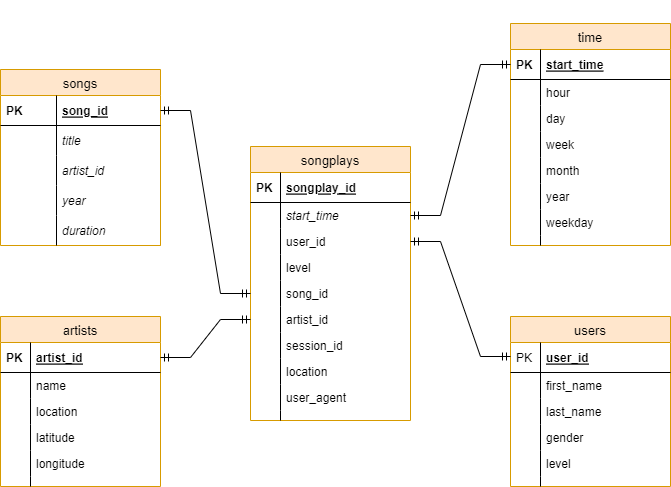

# Udacity Nanodegree Program - Project 1 Data Modelling with Postgres

## Table of Contents
1. [Description](#description)
2. [Using the application](#getting_started)
	1. [Requirements to run project](#dependencies)
	2. [Executing Program](#execution)
	3. [ETL pipeline and schema design](#pipeline_and_schema_design)
3. [Example queries](#example_queries)
4. [Acknowledgements](#acknowledgements)
5. [Authors](#authors)

## Description

The purpose of this project is to build an etl pipeline for a startup called Sparkify which is a music streaming application. Currently, there is no easy way to query the data they have collected through their music streaming application and the purpose of the etl pipeline is to store the data in a structured format to make the data more accessbile. The etl pipeline takes data currently stored in JSON log files and stores it in a structured way in a postgres database.

The main functionality of the etl pipeline includes:
1. Extracting the data from the JSON logs
2. Arranging the data into a structured set of tables within a Postgres database

## Using the application

### Requirements to run project
* Python 3.7+
* Data manipulation: pandas
* Postgres SQL with Python: psycopg2 already installed
* Retrieve files and path names: glob and os

### Executing Program:
1. Run the following command to create the database and tables:
    `create_tables.py`
    
2. Run the following command to perform the etl process:
    `etl.py`

2. Open the notebook file and run each cell to confirm that the records have been added to the database.
    

### ETL pipeline and schema design:
The ETL pipeline reads in the application log data (provided by Sparkify) contained within the JSON files and arranges the data into a relational Postgres database with the following schema:

There is one fact table called songplays and four dimension tables called songs, artists, time and users. The image displayed above shows the relationships between the tables. 

etl.py performs the following steps:
1. extracts the data from the song_data folder and populates the songs and artists table
2. extracts the data from the log_data folder and populates the time and users table
3. uses data from artist and song table in conjunction with log_data folder to populate the songplays table with records
4. etl.ipynb is used to test code before entering it into the etl.py file

sql_queries.py contains the following:
1. SQL queries for creating the tables
2. SQL queries for inserting records into the created tables
3. SQL queries for reading the data from artist and song tables
4. The sql_queries.py file is imported to etl.py to be used when inserting records to the tables.

test.ipynb is used to test whether records have been inserted into the tables successfully. 

## Example Queries
The following example queries can be used to get more insight about the data in the tables:
1. How many different songs does the database contain?
    `SELECT COUNT(song_id) FROM songs`
2. How many different artists exist in the database?
    `SELECT COUNT(artist_id) FROM artists`
3. How many different song have been played since the logging has started?
    `SELECT COUNT(songplay_id) FROM songplays`

## Acknowledgements
[Udacity](https://www.udacity.com/) for the first project of the data engineer nanodegree.
[Sparkify] for providing the data for the project. 

## Authors

* [Dirk Lambrechts](https://github.com/dirklambrechts)